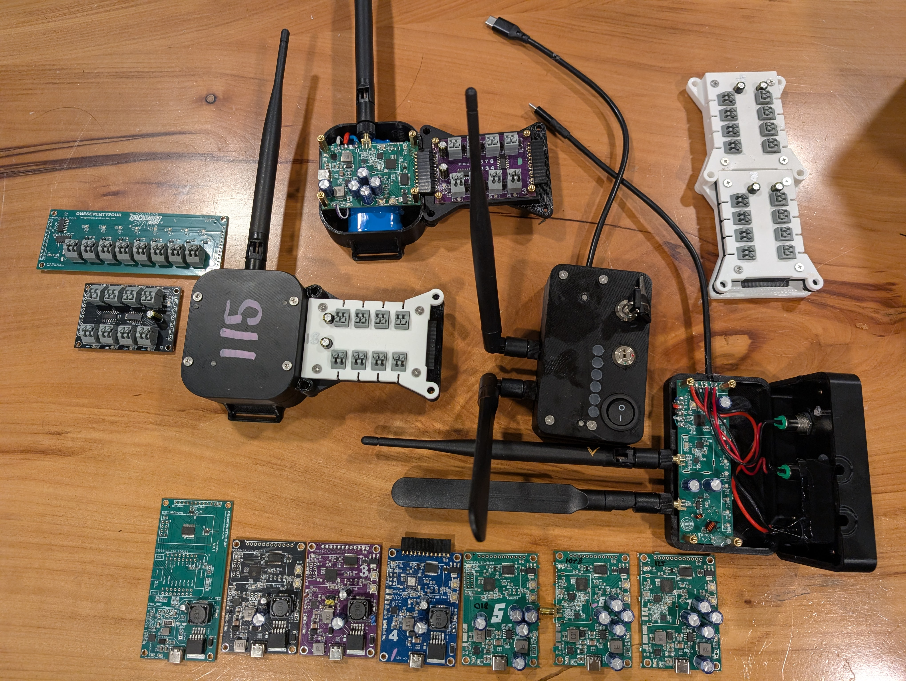
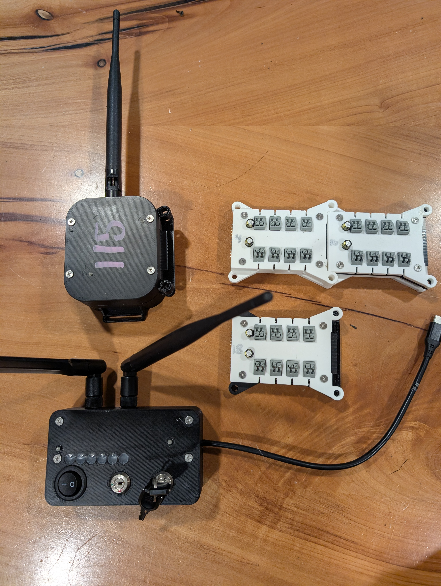

# Backyard Hero: An excessively DIY Firework Control System

## Images

<div align="center">
  
  
</div>
Uses custom, purpose-built boards and firmware/software built from the ground up to provide an effective, feature packed firing system for less than $100 (one dongle, one receiever and 2 8cue modules). Scales cheaply, at another receiver @ about 30 bucks and an 8 shot cue module for about 9 bucks. A receiver can take up to 128 cues, though it looks absolutely ridiculous. 

## Overview

Backyard Hero is an open-source firework control system designed for enthusiasts who want a powerful, flexible, and cost-effective solution. It features a local web interface for show design and execution, and supports both existing Bilusocn one-way receivers and a custom 2.4GHz bidirectional hardware platform.

**Version NYE2025.01** introduces major improvements including rack editing, YouTube video processing for firing profiles, enhanced receiver telemetry, pyromusical support, and significant reliability improvements.

This project provides the complete software, firmware, and hardware design resources.

## Documentation

Full end-user and developer documentation lives in the project Wiki:

> **[backyardhero wiki](https://github.com/Os4ivmb/backyardhero/wiki)** — getting started by OS, architecture deep-dives, RF protocol details, UI walkthrough, and reference docs.

The Wiki sources are checked into a sibling repo (`backyardhero_pyro.wiki/`). Highlights:

* **[Getting Started](https://github.com/Os4ivmb/backyardhero/wiki/Getting-Started)** — split by [macOS](https://github.com/Os4ivmb/backyardhero/wiki/Getting-Started-macOS), [Linux](https://github.com/Os4ivmb/backyardhero/wiki/Getting-Started-Linux), [Windows](https://github.com/Os4ivmb/backyardhero/wiki/Getting-Started-Windows).
* **[System Architecture](https://github.com/Os4ivmb/backyardhero/wiki/System-Architecture)** and **[Glossary & Terms](https://github.com/Os4ivmb/backyardhero/wiki/Glossary-and-Terms)**.
* **[Show Lifecycle](https://github.com/Os4ivmb/backyardhero/wiki/Show-Lifecycle)** and **[Example: end-to-end show](https://github.com/Os4ivmb/backyardhero/wiki/Example-Show-End-to-End)**.
* **[Receiver firmware](https://github.com/Os4ivmb/backyardhero/wiki/Receiver-Firmware)** and **[Dongle firmware](https://github.com/Os4ivmb/backyardhero/wiki/Dongle-Firmware)** deep-dives.
* **[Wire protocol](https://github.com/Os4ivmb/backyardhero/wiki/Wire-Protocol-Reference)**, **[Daemon command](https://github.com/Os4ivmb/backyardhero/wiki/Daemon-Command-Reference)**, and **[REST API](https://github.com/Os4ivmb/backyardhero/wiki/API-Reference)** references.

This README is intentionally short — start in the wiki for everything beyond a quickstart.

## Table of Contents

*   [Images](#images)
*   [Project Structure](#project-structure)
*   [System Capabilities](#system-capabilities)
    *   [Custom Hardware](#custom-hardware)
    *   [Software Platform](#software-platform)
    *   [Show Control Lifecycle](#show-control-lifecycle)
*   [Getting Started](#getting-started)
    *   [Prerequisites](#prerequisites)
    *   [Installation & Setup](#installation--setup)
    *   [Running the System](#running-the-system)
*   [Key Files & Directories](#key-files--directories)
*   [Target Audience & Community](#target-audience--community)
*   [What's Next? (Roadmap)](#whats-next-roadmap)
*   [Contributing](#contributing)
*   [License](#license)

## Project Structure

The project is organized into two primary directories:

*   `host/`: Contains all software components that run on the host computer (e.g., OSX/Windows laptop, Raspberry Pi). This includes the show builder, runner, and communication daemon.
*   `devices/`: Contains firmware, CAD files for enclosures, and PCB design overviews for the custom hardware components (receivers, cue modules, dongle).

### Host Software Components

The host software is containerized using Docker for ease of deployment and consists of:

*   **Next.js Web Application (`byh-app`)**: Provides the user interface for show design, inventory management, and firing control. Runs on port `1776`.
*   **Python WebSocket Server (`websock`)**: Enables real-time, bidirectional communication between the web application and the backend Python daemon. Runs on port `8090`.
*   **Python Firework Daemon (`firework-daemon`)**: Interfaces with the firework hardware (dongle) via a serial connection and manages the show execution logic.

These components are orchestrated by `supervisord` within the Docker container.

### Hardware Device Designs

The `devices/` directory includes resources for:

*   `os4_receiver/`: Custom 2.4GHz receiver with direct point-to-point communication (1000+ yard range).
*   `os4_cuemodule/`: Chainable 8-cue modules (expandable).
*   `os4_dongle/`: USB dongle for host communication with custom receivers and 433MHz systems.

Each directory contains firmware, enclosure CAD files, and PCB design details.

## System Capabilities

### Custom Hardware

The custom 2.4GHz hardware platform offers significant advantages:

*   **Direct RF Communication:** Receivers use raw point-to-point communication (non-mesh) with 1000+ yard range. Mesh networking was removed as it added unnecessary overhead - the direct range is more than sufficient for most applications.
*   **Superior RF Performance:** Meticulous PCB design and impedance matching maximize the performance of the onboard PA/LNA, ensuring robust communication.
*   **Long Battery Life:** On-board lithium batteries are rechargeable via USB-C PD (12V for fast charging) and provide well over 24 hours of continuous runtime.
*   **Expandable & Modular Cues:** Each receiver supports up to 128 cues via chainable 8-cue modules.
*   **Advanced Telemetry:** The system provides comprehensive real-time feedback including cue continuity, signal latency, ready count, success percentage, and receiver battery levels. All metrics are displayed in the UI with visual health indicators.
*   **Rugged Design:** 3D-printable enclosures are designed for durability and can be made water-resistant.. if you want.
*   **Dual-Frequency Dongle:** The custom dongle interfaces with the 2.4GHz custom receivers and also includes a 433MHz frontend for compatibility with BILUSOCN and similar one-way systems.
*   **Cost-Effectiveness:**
    *   Receiver: ~$27 (pre-tariff)
    *   Dongle: ~$25 (pre-tariff)
    *   8-Cue Module: ~$8 (pre-tariff)
    *   A complete 2-receiver, 32-cue system can be built for around $110 USD. Prices are above are what you need in materials to finish completed components

### Software Platform

The local web application, runnable on a laptop or a dedicated device like a Raspberry Pi, offers:

*   **Show Design:** A graphical interface for creating and managing firework shows with an improved UI.
*   **Rack Editing:** Create custom racks with configurable dimensions, assign shells to specific cells, and build fuse lines with visual representation. Racks can be assigned to receivers and integrated into shows.
*   **Inventory Management:** Keep track of your pyro stock with support for shell packs, firing profiles, and metadata. Automatically process lists of mortar effects - paste shell descriptions and the system extracts colors and effects, mapping them to standardized types for easy rack spot selection.
*   **YouTube Video Processing:** Automatically crawl YouTube videos and extract firing profiles by analyzing audio. The system can identify shot timings and optionally populate color information for shells.
*   **Pyromusical Support:** Upload audio files and synchronize show timing with music. The timeline includes waveform visualization for precise cue placement.
*   **Advanced Fusing Logic:** The show builder automatically incorporates delays for fused lines in racks, ensuring precise timing based on fuse burn rates.
*   **Cross-Platform Compatibility:** Runs on macOS, Linux, and Windows. See per-OS guides in the [Wiki](https://github.com/Os4ivmb/backyardhero/wiki/Getting-Started).

### Show Control Lifecycle

The system follows a lifecycle for show execution. I learned it from launching rockets and shit:

1.  **Initialization & Synchronization:** Upon power-on, receivers connect to the host, which synchronizes their clocks to within <10ms accuracy.
2.  **Show Staging:** Shows are loaded from a database, populating the UI, editor, and reflecting cue usage on the receiver status tabs.
3.  **System Loading & Verification:** The system verifies all custom receivers are online (433MHz systems are assumed operational). Firing instructions are then transmitted to each receiver. Cue status is indicated by LEDs on the modules:
    *   **Red:** Continuity required but not detected.
    *   **Green:** Continuity required and detected.
    *   **Blue:** Continuity detected but not required for the current show.
4.  **Arming the System:** Before starting, the physical 'start/stop' switch on the dongle must be moved to the 'start' position. (Shows will not load if the switch is not in 'stop').
5.  **Pre-Launch & Execution:**
    *   Pressing 'Play' in the UI triggers pre-launch checks (continuity, battery levels) on all receivers.
    *   If checks pass, a synchronized start time (T+25 s by default) is sent to all receivers, and the receivers take over autonomous cue scheduling. If any async receiver hasn't acknowledged readiness by T-10 s the start is aborted.
    *   By default the dongle's physical 'manual fire' switch must be flipped at T~5 s for the show to actually start ("delegate to client"). This can be disabled in Settings.
    *   Once running, custom receivers fire from their own internal schedule, independent of host RF — host comms are only used for live telemetry, pause, and stop.
6.  **Show Monitoring & Safety Abort:**
    *   The show runs according to the programmed sequence.
    *   Flipping the dongle switch to 'stop' or pressing the abort button in the UI immediately halts the show by sending a stop command to all receivers.
    *   Custom receivers will automatically stop if they lose contact with the host for more than ~10 seconds (adaptive based on recent host poll cadence).

## Getting Started

### Prerequisites

*   Docker + Docker Compose v2
*   Python 3.9+ (host-side, for the serial bridge)
*   macOS, Linux, or Windows (each fully supported — see the platform-specific guides in the Wiki)

### Installation & Setup

1.  **Clone the Repository:**
    ```bash
    git clone https://github.com/Os4ivmb/backyardhero.git
    cd backyardhero
    ```
2.  **Identify your dongle's serial port** (Device Manager on Windows, `ls /dev/tty.usbmodem*` on macOS, `ls /dev/ttyACM*` on Linux). Set this in either `host/config/systemcfg.json`'s `dongle_port`, or the `SERIAL_PORT` env var when launching.
3.  **Add your receivers** in the UI under **Settings → Receiver Config** after first boot. Receivers are stored in the SQLite database (`/data/backyardhero.db`); `systemcfg.json` only seeds the table on first run if it's empty.
4.  See **[Connecting the Dongle](https://github.com/Os4ivmb/backyardhero/wiki/Connecting-the-Dongle)** and **[Flashing a Receiver](https://github.com/Os4ivmb/backyardhero/wiki/Flashing-a-Receiver)** for hardware setup.

### Running the System

Each platform has its own folder under `host/run/` with launchers, compose files, and (on Pi) an installer. Pick yours and follow the README inside it.

| Platform | Folder | Quickstart |
| --- | --- | --- |
| **Raspberry Pi** (controller / AP) | [`host/run/pi/`](host/run/pi/README.md) | `sudo host/run/pi/install.sh` (one-shot install + AP + systemd unit) |
| **macOS** (dev) | [`host/run/osx/`](host/run/osx/README.md) | `host/run/osx/start.sh` (prod) or `start-dev.sh` (hot-reload) |
| **Windows** (dev) | [`host/run/windows/`](host/run/windows/README.md) | `host\run\windows\start.bat` |

Then open `http://localhost:1776` (or `http://backyardhero/` if you're on the Pi's AP).

For maintainers who need to build and push the prebuilt image, see `host/run/osx/build_and_push_docker.sh` or its Windows equivalent.

See **[Production vs Development Mode](https://github.com/Os4ivmb/backyardhero/wiki/Production-vs-Development-Mode)** for details.

## Key Files & Directories

*   `host/run/`: **Per-platform** launchers, compose files, installers. See [`host/run/README.md`](host/run/README.md) for the layout, then jump to your platform's folder.
*   `host/Dockerfile`: Build recipe for the `firework-system` image (one image, all platforms).
*   `host/supervisord.conf`, `host/supervisord.dev.conf`: Run *inside* the container; manage the Next.js app, WebSocket server, and Python daemon.
*   `host/tcp_serial_bridge/tcp_serial_bridge.py`: Host-side bridge from the container's TCP socket to the dongle's USB serial port.
*   `host/config/systemcfg.json`: System config — serial port, dongle protocol, RF protocol definitions. Receivers live in SQLite.
*   `host/byh_app/`: Next.js frontend.
*   `host/pythings/pc_daemon/`: Python firework daemon.
*   `host/pythings/ws_server/`: Python WebSocket server (state fan-out).
*   `devices/os4_receiver/`, `devices/os4_dongle/`, `devices/os4_cuemodule/`: Firmware, CAD, PCB.
*   `devices/utils/`: Receiver/dongle build + flash tooling (`build_receiver.sh`, `flash_receiver.py`, `build_dongle.sh`, `flash_dongle.py`).

## Target Audience & Community

This project is for pyrotechnic hobbyists and DIY electronics enthusiasts looking for a highly capable, customizable, and affordable firing system. It serves as a robust foundation for a community-driven platform where users can share improvements, new features, and hardware modifications.

While the custom RF hardware designs would require FCC certification for commercial sale, the complete software, firmware, and design concepts are provided. The maintainer welcomes collaboration, especially on the hardware aspects, and is willing to share detailed design/production resources and potentially provide hardware modules for testing to active contributors (at material cost).

## Version History

### NYE2025.01 (Current)

*   **Rack Editing System:** Full rack creation and management - design custom rack layouts, assign shells to cells, create and visualize fuse lines, and assign racks to receivers. Auto-processing of shell description lists extracts colors and effects, making it easy to choose shells for rack spots based on color/effect filters.
*   **Auto Shell Description Processing:** Paste lists of mortar shell descriptions and the system automatically extracts colors and effects, maps them to standardized types, and creates inventory entries. Makes it easy to filter and select shells by color or effect when building racks.
*   **Add from Library:** Import shells and effects directly from a comprehensive catalog library, making it easy to add common pyrotechnic products to your inventory without manual data entry.
*   **YouTube Video Processing:** Automated firing profile extraction from YouTube videos with audio analysis. Supports color detection and population for shells.
*   **Enhanced Receiver Telemetry:** Comprehensive telemetry including ready count, latency tracking, success percentage, and real-time health monitoring.
*   **RF Protocol Improvements:** Switched from mesh networking to direct point-to-point communication. Achieves 1000+ yard range without mesh overhead, improving reliability and reducing complexity.
*   **Pyromusical Support:** Audio file upload and timeline synchronization with waveform visualization for music-synchronized shows.
*   **Reliability & Resiliency:** Numerous fixes and improvements to receiver/transmitter communication, error handling, and recovery mechanisms.
*   **UI Revamp:** Improved user interface in multiple areas including show builder, receiver status displays, and inventory management.

## What's Next?

This project is actively evolving. Here are some potential areas for future development:

*   **Enhanced UI/UX:** Continuously improving the web interface for better usability and more advanced show design features.
*   **Expanded Hardware Support:**
    *   Developing more pre-designed hardware modules, maybe a DMX module instead of an 8 cue. 
    *   Official support and documentation for Raspberry Pi as a dedicated host device.
*   **Advanced Show Synchronization:** Pyromusical support is now available - upload audio files and sync cues to music with waveform visualization.

*   **Comprehensive Documentation:** Expanding documentation for developers, hardware builders, and end-users.
*   **Windows Native Support:** Improving native Windows support beyond the current Docker-based `start.bat`.

Your contributions and suggestions are welcome - though if they dont come with help, its 50/50 if anything will come of it. 


## License

Dont be a dick
