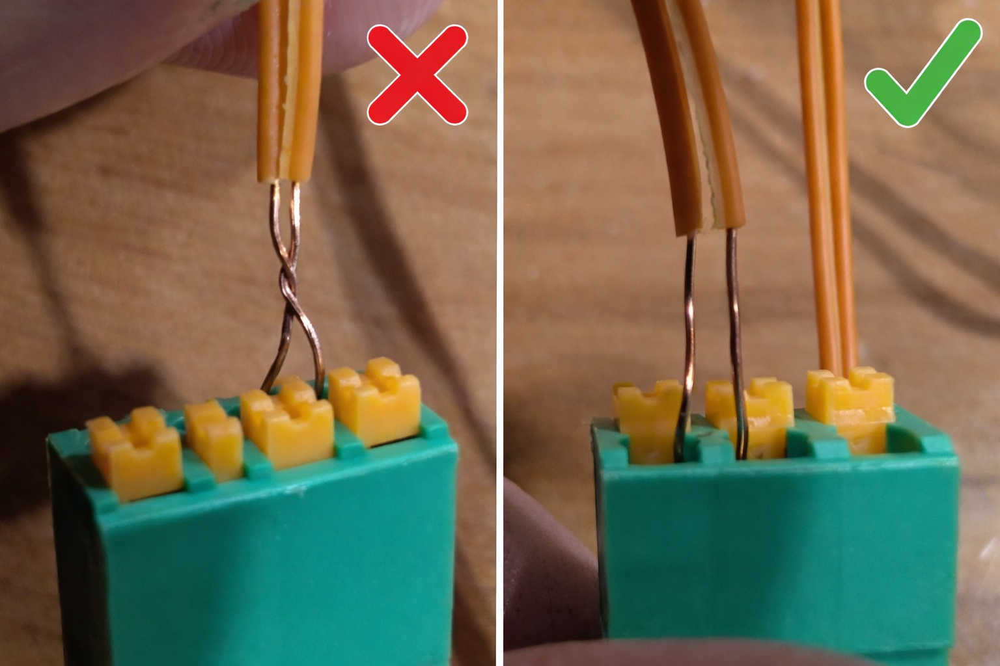

# Cue Module Getting Started Guide

> **Note:** This guide covers the OS4 cue module. Each module provides 8 firing channels and can be chained together to support up to 128 cues per receiver.

## Important Safety Cautions

⚠️ **Short Circuit Warning:**
- While the system includes continuity checking, it does **not** detect short circuits
- Ensure your cue wires are **not** twisted together at the terminal and touching



- If the system fires into a short circuit, it will shut itself down, which will effectively disable that receiver for the rest of the show
- Always verify wire connections before powering on

## Connecting to the Receiver

A cue module should connect snugly to a receiver (or to another cue module in a chain). 

**Connection Tips:**
- If the pins are misaligned, gently rock the cue module up and down to help align them
- **Do not exert excessive force** - this can damage the pins and require re-soldering
- Ensure the connection is secure before powering on 

## Cue Position Numbering

The cue positions run from **close to the receiver**, along the **far side of the antenna**, down the side, then reset to the other side *per module*. The count continues sequentially at the next module in the chain.

**Example: 2 Cue Modules Chained Together**

```
|_____RECEIVER______|
--------CUE----------
1                   5
2                   6
3                   7
4                   8
---------------------
--------CUE----------
9                  13
10                 14
11                 15
12                 16
---------------------
```

**Positioning Pattern:**
- Positions 1-4: Near side (closest to receiver)
- Positions 5-8: Far side (opposite side)
- Next module continues from position 9
- This pattern repeats for each additional module in the chain

## LED Status Indicators

During show execution, the LED lights for each cue will cycle/fade to indicate show state transitions. These states are synchronized with the status lights on the receiver.

### Cue LED States

Each cue position can display one of 5 states:

| Color | State | Description |
|-------|-------|-------------|
| **Off** | Standby | No cue assigned in the show, and nothing is plugged in |
| **Blue** | Available | Cue is plugged in, but not assigned in the currently loaded show |
| **Red** | Continuity Required | Cue is assigned in the loaded show, but no ignitor continuity is detected |
| **Green** | Ready | Cue is assigned in the loaded show **and** continuity is detected |
| **Yellow** | Firing | The cue is actively firing |

## Hardware Configuration

The cue module boards come almost complete from the factory. The main configuration decision is how many **bulk capacitors** to add.

### Bulk Capacitors

Bulk capacitors allow cue modules to be chained in much larger lengths and sustain much higher numbers of simultaneously firing cues.

**When to Add Bulk Capacitors:**

- **Not Required:** If you're only using 2-3 chained cue modules maximum, and less than 4 simultaneously firing cues
- **Recommended:** If you're going to 4+ modules or firing 4+ cues simultaneously:
  - Add **1-2 bulk capacitors** to each module, OR
  - Add **3-4 bulk capacitors** to the **end module** in the chain

**Installation:**
Once bulk capacitors are installed (if needed), the modules are ready to use.

## Terminal Types: Push-Style vs Plug-Style

### Push-Style (Legacy)
- **Gray terminals** that require the small gray squares to be pushed down firmly for the port to accept the wire
- **Disadvantage:** Difficult to use in cold weather conditions
- **Status:** Replaced by plug-style in newer versions

### Plug-Style (Current)
- **Recommended:** The newer plug-style terminals have replaced push-style
- **Advantages:**
  - Accepts either **screw-type** or **push-type** male plugs
  - Allows you to easily plug in cues in the field
  - More user-friendly, especially in cold weather
  - Reduces finger strain during setup